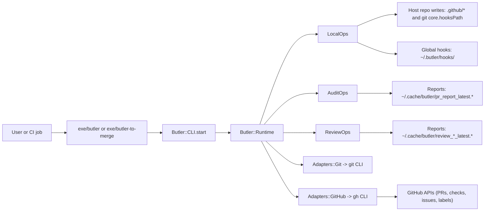
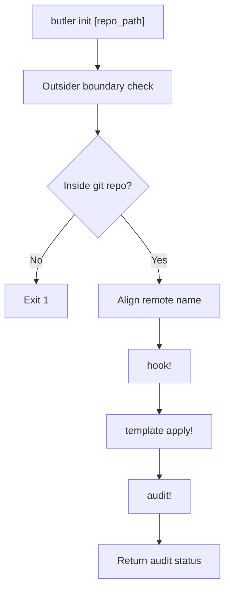
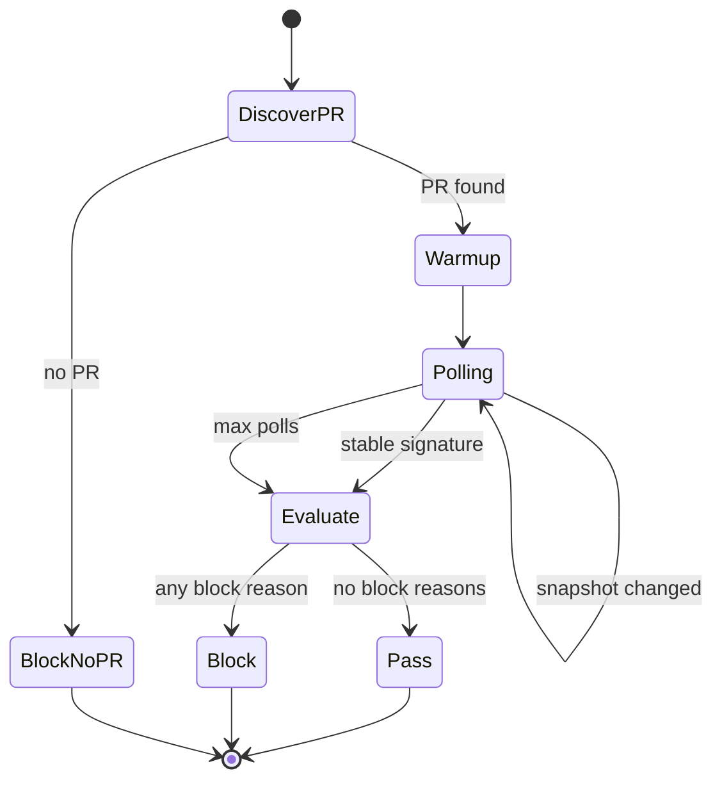

# Butler Technical Review (Senior-Level)

Scope: Butler codebase architecture and subsystem review.

## 1) What Butler is, in architectural terms

Butler is a Ruby gem that acts as an **outsider governance runtime**.
Its key design choice is: keep Butler-owned operational artefacts outside client repositories, while still managing selected GitHub-native files inside them (`.github/*`).

Primary statement of intent:
- `README.md:3`
- `README.md:44`
- `docs/butler_tech_guide.md:13`

## 2) System structure at a glance

This diagram maps directly to:
- entrypoints: `exe/butler:7`, `exe/butler-to-merge:8`
- dispatch: `lib/butler/cli.rb:88`
- runtime wiring: `lib/butler/runtime.rb:21`
- concern split: `lib/butler/runtime.rb:164`

## 3) Codebase topology (what each area owns)

| Area | Responsibility | Key file |
|---|---|---|
| Executables | CLI launchers (`butler`, `butler-to-merge`) | `exe/butler` |
| CLI parsing | Parse args/subcommands, instantiate runtime, dispatch | `lib/butler/cli.rb` |
| Runtime shell | Shared helpers, exit contract, adapters, report constants | `lib/butler/runtime.rb` |
| Local governance | `sync`, `prune`, `hook`, `check`, `init`, `template` | `lib/butler/runtime/local_ops.rb` |
| Audit reporting | `audit`, PR/check monitor, scope integrity guard | `lib/butler/runtime/audit_ops.rb` |
| Review governance | `review gate`, `review sweep`, GraphQL/REST normalisation, issue upsert | `lib/butler/runtime/review_ops.rb` |
| Config | Built-in defaults + env overrides + validation | `lib/butler/config.rb` |
| Git/GitHub adapters | Process wrappers over `git` and `gh` | `lib/butler/adapters/git.rb`, `lib/butler/adapters/github.rb` |
| Managed artefacts | Hook templates and `.github` templates | `assets/hooks/*`, `templates/.github/*` |
| Automation and release | CI, sweep schedule, reusable policy, publish jobs | `.github/workflows/*` |
| Smoke testing | End-to-end shell smoke suites | `script/ci_smoke.sh`, `script/review_smoke.sh` |

## 4) Runtime model and contracts

### Exit contract (strongly defined)

- `0`: OK
- `1`: runtime/configuration error
- `2`: policy block

Defined centrally:
- `lib/butler/runtime.rb:8`

This is one of the strongest design traits: all command surfaces consistently target this contract.

### Fixed report location

- Primary: `~/.cache/butler`
- Fallback 1: `$TMPDIR/butler` when `TMPDIR` is set to an absolute path
- Fallback 2: `/tmp/butler` when no absolute `TMPDIR` is available

Implemented in:
- `lib/butler/runtime.rb:69`

### Config strategy

Butler intentionally avoids host-repo config files and uses built-in config with env overrides:
- defaults: `lib/butler/config.rb:20`
- env overrides: `lib/butler/config.rb:70`
- validation: `lib/butler/config.rb:127`

Notable configurable knobs:
- hooks path via `BUTLER_HOOKS_BASE_PATH`
- review timing via `BUTLER_REVIEW_WAIT_SECONDS`, `BUTLER_REVIEW_POLL_SECONDS`, `BUTLER_REVIEW_MAX_POLLS`
- sweep window/states via `BUTLER_REVIEW_SWEEP_WINDOW_DAYS`, `BUTLER_REVIEW_SWEEP_STATES`

## 5) Command surface and internal dispatch

`CLI.start` behaviour:
- `--help/-h` => help + exit 0
- `--version/-v` or `version` => print version
- no args => defaults to `audit`
- subcommands for `init`, `template`, `review`

Core file:
- `lib/butler/cli.rb:5`
- `lib/butler/cli.rb:41`
- `lib/butler/cli.rb:91`

## 6) LocalOps deep walkthrough (`sync`, `prune`, `hook`, `init`, `check`, `template`)

### `sync!`

Flow:
1. outsider fingerprint block check
2. require clean working tree
3. `git fetch --prune`
4. switch to main if needed
5. `git pull --ff-only`
6. verify ahead/behind count
7. restore original branch in `ensure`

Key refs:
- `lib/butler/runtime/local_ops.rb:4`
- `lib/butler/runtime/local_ops.rb:267`

### `prune!`

Important design: prune only branches with deleted tracked upstreams (`gone`), not untracked local branches.

Force-delete path exists, but only with strict evidence:
- delete failed for “not fully merged”
- branch matches managed pattern (`codex/...`)
- GH evidence shows merged PR for exact branch tip SHA into main

Key refs:
- `lib/butler/runtime/local_ops.rb:35`
- `lib/butler/runtime/local_ops.rb:355`
- `lib/butler/runtime/local_ops.rb:375`
- `lib/butler/runtime/local_ops.rb:391`

### `hook!` and `check!`

- hooks are copied from Butler assets to `~/.butler/hooks/<version>`
- symlink hooks are explicitly blocked
- `core.hooksPath` is set to managed path
- `check!` is strict health check mode

Key refs:
- `lib/butler/runtime/local_ops.rb:96`
- `lib/butler/runtime/local_ops.rb:149`
- `lib/butler/runtime/local_ops.rb:242`
- `lib/butler/runtime/local_ops.rb:309`

### `init!`

Orchestrates onboarding sequence:
- verify git work tree
- align remote naming (`origin` -> `github` if needed)
- run `hook!`
- run `template_apply!`
- run `audit!`
- return audit status

Key refs:
- `lib/butler/runtime/local_ops.rb:126`
- `lib/butler/runtime/local_ops.rb:449`

### `template_check!` / `template_apply!`

- whole-file drift model, not marker-fragment model
- newline normalisation avoids CRLF false drift
- secure path resolve prevents traversal outside repo root

Key refs:
- `lib/butler/runtime/local_ops.rb:159`
- `lib/butler/runtime/local_ops.rb:175`
- `lib/butler/runtime/local_ops.rb:227`
- `lib/butler/runtime.rb:68`

## 7) Outsider boundary model (critical concept)

Every governance command starts with `block_if_outsider_fingerprints!`:
- blocks `.butler.yml`
- blocks `bin/butler`
- blocks `.tools/butler`
- scans for legacy marker token content

And it exempts the Butler repository itself (`repo_root == tool_root`) so Butler can evolve its own code.

Key refs:
- `lib/butler/runtime/local_ops.rb:314`
- `lib/butler/runtime/local_ops.rb:323`
- `lib/butler/runtime/local_ops.rb:338`

## 8) AuditOps deep walkthrough

`audit!` assembles operational posture in one run:
- repository metadata
- working tree summary
- hooks health
- main sync state
- PR/check monitor (via `gh`)
- scope integrity guard
- writes machine + human reports

Key refs:
- `lib/butler/runtime/audit_ops.rb:4`
- `lib/butler/runtime/audit_ops.rb:50`
- `lib/butler/runtime/audit_ops.rb:134`
- `lib/butler/runtime/audit_ops.rb:193`

Important nuance:
- scope integrity issues currently result in `attention`, not hard block (exit remains 0 unless another blocking condition exists).

## 9) ReviewOps deep walkthrough (the most complex subsystem)

This file is the policy engine for merge readiness and late-review surveillance.

### `review gate`

Core loop:
1. find PR for current branch (or `BUTLER_PR_NUMBER` override)
2. warm-up wait
3. poll snapshots
4. detect convergence using signature
5. block if non-converged, unresolved threads, or unacknowledged actionable items

Signature fields:
- `latest_activity`
- unresolved URLs
- unacknowledged actionable URLs

Key refs:
- `lib/butler/runtime/review_ops.rb:4`
- `lib/butler/runtime/review_ops.rb:182`
- `lib/butler/runtime/review_ops.rb:199`

### Actionable classification model

Actionable items include:
- unresolved non-outdated threads
- non-author `CHANGES_REQUESTED` reviews
- non-author comments/reviews containing risk keywords
- then filtered by Codex disposition acknowledgements authored by PR author

Key refs:
- `lib/butler/runtime/review_ops.rb:524`
- `lib/butler/runtime/review_ops.rb:543`
- `lib/butler/runtime/review_ops.rb:577`
- `lib/butler/runtime/review_ops.rb:1023`

### GraphQL + pagination strategy

Butler fetches details from GraphQL and paginates `reviewThreads`, `comments`, and `reviews`, so gating decisions are based on complete connection sets.

Key refs:
- `lib/butler/runtime/review_ops.rb:232`
- `lib/butler/runtime/review_ops.rb:250`
- `lib/butler/runtime/review_ops.rb:281`

### `review sweep`

- scans recently updated PRs (windowed)
- maps PR states to open/closed sweep states
- for closed/merged PRs, only includes events after close/merge baseline
- upserts one rolling tracking issue and label

Key refs:
- `lib/butler/runtime/review_ops.rb:116`
- `lib/butler/runtime/review_ops.rb:684`
- `lib/butler/runtime/review_ops.rb:741`
- `lib/butler/runtime/review_ops.rb:835`
- `lib/butler/runtime/review_ops.rb:871`

## 10) CI, distribution, and operational integration

### CI workflow

Two jobs:
- governance (`review gate`)
- smoke (syntax + indentation + naming/privacy guards + smoke scripts)

File:
- `.github/workflows/ci.yml:8`
- `.github/workflows/ci.yml:36`

### Scheduled sweep

Runs every 8 hours:
- `.github/workflows/review-sweep.yml:5`

### Reusable host policy workflow

Checks out host + Butler runtime, validates version, installs gem from source checkout, runs `butler hook`, `butler audit`, `butler review gate`.

File:
- `.github/workflows/butler_policy.yml:4`
- `.github/workflows/butler_policy.yml:63`

### Publish workflows

- GitHub Packages: `.github/workflows/publish-github-packages.yml:1`
- RubyGems: `.github/workflows/publish-rubygems.yml:1`

## 11) Managed assets and policy artefacts

- Hook scripts block direct commits/merges/pushes on `main/master`:
  - `assets/hooks/prepare-commit-msg:5`
  - `assets/hooks/pre-merge-commit:5`
  - `assets/hooks/pre-push:8`
- Managed `.github` templates encode governance checklist and review-gate expectations:
  - `templates/.github/copilot-instructions.md:1`
  - `templates/.github/pull_request_template.md:1`

## 12) Engineering assessment (strengths, trade-offs, risks)

### Strengths

- Clear bounded architecture: CLI -> runtime concerns -> adapters.
- Very explicit exit-code contract for automation.
- Strong outsider boundary enforcement.
- Deterministic report outputs and filenames.
- Defensive GH error handling and fallback reporting paths.
- Practical smoke suites exercising real command flows.

### Trade-offs / hotspots

- `review_ops.rb` is large (1069 lines), mixing orchestration, API transport shape, normalisation, and report rendering.
- outsider legacy-marker scan walks and reads all repo files on each command; this is simple but potentially heavy on large repos.
- Configuration is intentionally centralised and opinionated; this reduces drift but also limits per-repo adaptability.
- Heavy dependence on `gh` runtime availability and auth quality for review features.
