# Carson Technical Guide

## Purpose

Carson is an outsider governance runtime for repository hygiene and merge-readiness controls.

Its design goal is operational discipline with minimal host-repository footprint.

Audience: Carson contributors and advanced operators who need technical behaviour details.

Common-user operations belong in `docs/carson_user_guide.md`.

==Carson carries its own runtime assets and does not rely on Carson-owned files inside host repositories.==

## Scope and Boundaries

In scope:

- local governance commands (`audit`, `sync`, `prune`, `hook`, `check`, `init`, `offboard`, `template`, `review`)
- deterministic review gating and scheduled late-review sweeps through GitHub CLI
- whole-file management of selected GitHub-native files (`.github/*`)
- global hook installation under Carson runtime home
- exact exit-status contract for automation use

Out of scope:

- replacing GitHub as merge authority
- host-repository business logic policy
- merge execution or force merge decisions
- host-repository Carson-specific configuration files

Boundary rules:

- host repository must not contain Carson-owned artefacts (`.carson.yml`, `bin/carson`, `.tools/carson/*`)
- host repository may contain GitHub-native policy files managed by Carson

## Module Relationships

- `exe/carson`: primary executable entrypoint
- `lib/carson/cli.rb`: command parsing and dispatch
- `lib/carson/config.rb`: built-in runtime defaults and environment override handling
- `lib/carson/runtime.rb`: runtime wiring, shared helpers, and concern loading
- `lib/carson/runtime/local.rb`: local repository operations and hook/template/runtime boundary helpers
- `lib/carson/runtime/audit.rb`: audit reporting, PR/check monitor report generation, and scope integrity guard
- `lib/carson/runtime/review.rb`: review gate/review sweep command entrypoints
- `lib/carson/runtime/review/data_access.rb`: GitHub query/pagination and payload normalisation
- `lib/carson/runtime/review/gate_support.rb`: review gate snapshot/actionability/report helpers
- `lib/carson/runtime/review/sweep_support.rb`: review sweep findings/tracking issue/report helpers
- `lib/carson/runtime/review/query_text.rb`: GraphQL query text
- `lib/carson/runtime/review/utility.rb`: shared parsing/matching helpers
- `lib/carson/adapters/git.rb`: git process adapter
- `lib/carson/adapters/github.rb`: GitHub CLI process adapter
- `templates/.github/*`: canonical managed GitHub-native files
- `assets/hooks/*`: canonical hook assets
- `script/bootstrap_repo_defaults.sh`: branch-protection and secret bootstrap helper

`*_ops.rb` purpose:

- keep `Runtime` as the single orchestration object
- group methods by workflow ownership (`local`, `audit`, `review`)
- keep command dispatch in `CLI` while placing command logic in runtime concerns

Current line count reality:

- `local.rb`: multi-workflow local governance and hook/template helpers
- `audit.rb`: audit state and monitor report writing
- `review/*.rb`: gate/sweep concerns split by data access, gate logic, sweep logic, queries, and shared helpers

Rails-derived split rule used by Carson:

- split by behaviour ownership, not arbitrary line count
- keep one primary responsibility per file
- keep thin entrypoints (`CLI`) and move behaviour into concern files
- avoid no-op wrapper files that only forward one call
- split further when a file mixes unrelated helper clusters or integrations

## Core Flow

1. For new repositories, run `carson init [repo_path]` to apply baseline setup in one command.
2. Run `carson audit` to evaluate local policy state.
3. If required, run `carson hook` then `carson check`.
4. Keep local `main` aligned using `carson sync`.
5. Remove stale local branches using `carson prune`.
6. Keep managed `.github/*` files aligned using `carson template check` and `carson template apply`.
7. Before merge recommendation, run `gh pr list --state open --limit 50` and `carson review gate`.
8. Scheduled automation runs `carson review sweep` for late actionable review activity.
9. If retiring Carson from a repository, run `carson offboard [repo_path]`.

Exit status contract:

- `0 - OK`
- `1 - runtime/configuration error`
- `2 - policy blocked (hard stop)`

## Feature: Outsider Boundary Enforcement

Mechanism:

- Runtime checks host repository for forbidden Carson fingerprints.
- Violations are reported as hard blocks before governance execution proceeds.

Blocked host artefacts:

- `.carson.yml`
- `bin/carson`
- `.tools/carson/*`

Key code segments:

- `block_if_outsider_fingerprints!` in `lib/carson/runtime/local.rb`
- `outsider_fingerprint_violations` in `lib/carson/runtime/local.rb`

Boundary:

- Carson repository itself is exempt from this check so Carson can evolve its own codebase.

## Feature: Global Hook Runtime

Mechanism:

- Hook assets are read from `assets/hooks/*`.
- Hooks are installed to `~/.carson/hooks/<version>/`.
- Repository `core.hooksPath` is set to that global path.

Key code segments:

- `hook!` in `lib/carson/runtime/local.rb`
- `hooks_dir` in `lib/carson/runtime/local.rb`
- `hook_template_path` in `lib/carson/runtime/local.rb`
- `hooks_health_report` in `lib/carson/runtime/local.rb`

Boundary:

- Carson does not create `.githooks/*` inside host repositories.

## Feature: One-command initialisation (`init`)

Mechanism:

- `init` verifies the target path is a git repository.
- It ensures Carson remote naming against configured `git.remote` (default `github`), renaming `origin` when appropriate.
- It then executes baseline setup sequence: `hook`, `template apply`, `audit`.

Key code segments:

- `init!` in `lib/carson/runtime/local.rb`
- `align_remote_name_for_carson!` in `lib/carson/runtime/local.rb`

Boundary:

- `init` does not commit changes in the host repository.
- Merge authority and required checks remain GitHub controls.

## Feature: Repository retirement (`offboard`)

Mechanism:

- `offboard` verifies the target path is a git repository.
- It unsets `core.hooksPath` only when the configured value points to Carson-managed hooks base path.
- It removes Carson-managed template files and known Carson-specific artefacts in the host repository.

Key code segments:

- `offboard!` in `lib/carson/runtime/local.rb`
- `disable_carson_hooks_path!` in `lib/carson/runtime/local.rb`
- `offboard_cleanup_targets` in `lib/carson/runtime/local.rb`

Boundary:

- `offboard` does not remove user-owned hook configurations that are not Carson-managed.

## Feature: GitHub Template Management

Mechanism:

- Template sources live in `templates/.github/*`.
- Drift checks compare full file content (normalised line endings).
- Apply writes full managed file content.

Managed files:

- `.github/copilot-instructions.md`
- `.github/pull_request_template.md`

Workflow:

1. Run `carson template check` to detect drift.
2. Run `carson template apply` to write canonical content.

Drift reasons:

- `missing_file`: target file does not exist.
- `content_mismatch`: target file content differs from canonical content.

Key code segments:

- `template_results` in `lib/carson/runtime/local.rb`
- `template_result_for_file` in `lib/carson/runtime/local.rb`
- `template_check!` in `lib/carson/runtime/local.rb`
- `template_apply!` in `lib/carson/runtime/local.rb`

Boundary:

- Managed files are GitHub-native host files.
- Carson-specific marker syntax is not used.

## Feature: Review Gate and Review Sweep

Mechanism:

- `review gate` waits for warm-up, polls for convergence, and blocks on unresolved actionable findings.
- Actionable findings include unresolved threads, non-author `CHANGES_REQUESTED`, and risk-keyword top-level comments/reviews.
- `review sweep` scans recent open/closed pull requests and upserts one rolling tracking issue.

Key code segments:

- `review_gate!` in `lib/carson/runtime/review.rb`
- `review_gate_snapshot` in `lib/carson/runtime/review/gate_support.rb`
- `review_sweep!` in `lib/carson/runtime/review.rb`
- `upsert_review_sweep_tracking_issue` in `lib/carson/runtime/review/sweep_support.rb`

Boundary:

- Carson provides deterministic governance signals.
- Merge authority remains GitHub plus human judgement.

## Feature: Branch Hygiene and Main Sync

Mechanism:

- `sync` requires clean tree and fast-forwards local `main` from configured remote.
- `prune` targets only local branches tracking deleted upstream refs.
- Force-delete path is gated by merged-PR evidence for exact branch tip.

Key code segments:

- `sync!` in `lib/carson/runtime/local.rb`
- `prune!` in `lib/carson/runtime/local.rb`
- `stale_local_branches` in `lib/carson/runtime/local.rb`
- `force_delete_evidence_for_stale_branch` in `lib/carson/runtime/local.rb`

Insight:

==Prune targets only branches whose tracked upstream ref is gone; untracked local branches are intentionally excluded.==

## Feature: Runtime Configuration

Mechanism:

- Runtime uses built-in defaults from `lib/carson/config.rb`.
- Runtime optionally merges global user config from `~/.carson/config.json` (or `CARSON_CONFIG_FILE` override).
- Report output precedence is global `~/.cache/carson`, then `TMPDIR/carson` when `HOME` is invalid and `TMPDIR` is absolute, then `/tmp/carson`.
- Environment overrides exist for hooks path, scope/review policy fields, review timing, sweep window/states, and Ruby indentation policy.
- Host repository configuration file loading is intentionally disabled.

Key code segments:

- `Carson::Config.default_data` in `lib/carson/config.rb`
- `Carson::Config.apply_env_overrides` in `lib/carson/config.rb`
- `Carson::Config#validate!` in `lib/carson/config.rb`

Boundary:

- Customisation remains centralised in Carson runtime, not in host repositories.

## Feature: FAQ

Q: Why keep Carson outside host repositories?  
A: It keeps host repositories clean and avoids Carson-specific operational drift.

Q: Why still write `.github/*` files in host repositories?  
A: Those files are GitHub-native policy inputs required by GitHub workflows and review tooling.

Q: Why does Carson block on `.carson.yml` now?  
A: Outsider mode forbids host Carson configuration artefacts to preserve boundary clarity.

Q: Why install hooks globally instead of inside each repository?  
A: It keeps Carson-owned hook assets outside host repositories while still enforcing local protections.

Q: Can Carson still support deterministic CI behaviour?  
A: Yes. CI pins exact Carson version and runs the same exit-status contract.

## References

- `README.md`
- `RELEASE.md`
- `VERSION`
- `carson.gemspec`
- `lib/carson/cli.rb`
- `lib/carson/config.rb`
- `lib/carson/runtime.rb`
- `lib/carson/runtime/local.rb`
- `lib/carson/runtime/audit.rb`
- `lib/carson/runtime/review.rb`
- `lib/carson/runtime/review/*.rb`
- `assets/hooks/pre-commit`
- `assets/hooks/pre-push`
- `assets/hooks/pre-merge-commit`
- `assets/hooks/prepare-commit-msg`

## Senior Technical Review (Merged)

Scope: Carson codebase architecture and subsystem review.

## 1) What Carson is, in architectural terms

Carson is a Ruby gem that acts as an **outsider governance runtime**.
Its key design choice is: keep Carson-owned operational artefacts outside client repositories, while still managing selected GitHub-native files inside them (`.github/*`).

Primary statement of intent:
- `README.md:3`
- `README.md:44`
- `docs/carson_tech_guide.md:13`

## 2) System structure at a glance

This diagram maps directly to:
- entrypoint: `exe/carson:7`
- dispatch: `lib/carson/cli.rb:88`
- runtime wiring: `lib/carson/runtime.rb:21`
- concern split: `lib/carson/runtime.rb:164`

## 3) Codebase topology (what each area owns)

| Area | Responsibility | Key file |
|---|---|---|
| Executables | CLI launchers (`carson`) | `exe/carson` |
| CLI parsing | Parse args/subcommands, instantiate runtime, dispatch | `lib/carson/cli.rb` |
| Runtime shell | Shared helpers, exit contract, adapters, report constants | `lib/carson/runtime.rb` |
| Local governance | `sync`, `prune`, `hook`, `check`, `init`, `template` | `lib/carson/runtime/local.rb` |
| Audit reporting | `audit`, PR/check monitor, scope integrity guard | `lib/carson/runtime/audit.rb` |
| Review governance | `review gate`, `review sweep`, GraphQL/REST normalisation, issue upsert | `lib/carson/runtime/review.rb` + `lib/carson/runtime/review/*.rb` |
| Config | Built-in defaults + global user config + env overrides + validation | `lib/carson/config.rb` |
| Git/GitHub adapters | Process wrappers over `git` and `gh` | `lib/carson/adapters/git.rb`, `lib/carson/adapters/github.rb` |
| Managed artefacts | Hook templates and `.github` templates | `assets/hooks/*`, `templates/.github/*` |
| Automation and release | CI, sweep schedule, reusable policy, publish jobs | `.github/workflows/*` |
| Smoke testing | End-to-end shell smoke suites | `script/ci_smoke.sh`, `script/review_smoke.sh` |

## 4) Runtime model and contracts

### Exit contract (strongly defined)

- `0`: OK
- `1`: runtime/configuration error
- `2`: policy block

Defined centrally:
- `lib/carson/runtime.rb:8`

This is one of the strongest design traits: all command surfaces consistently target this contract.

### Fixed report location

- Primary: `~/.cache/carson`
- Fallback 1: `$TMPDIR/carson` when `TMPDIR` is set to an absolute path
- Fallback 2: `/tmp/carson` when no absolute `TMPDIR` is available

Implemented in:
- `lib/carson/runtime.rb:69`

### Config strategy

Carson intentionally avoids host-repo config files and uses built-in config + global user config + env overrides:
- defaults: `lib/carson/config.rb:20`
- global config load: `lib/carson/config.rb`
- env overrides: `lib/carson/config.rb:115`
- validation: `lib/carson/config.rb:127`

Notable configurable knobs:
- hooks path via `CARSON_HOOKS_BASE_PATH`
- config file path via `CARSON_CONFIG_FILE`
- review disposition prefix via `CARSON_REVIEW_DISPOSITION_PREFIX`
- review timing via `CARSON_REVIEW_WAIT_SECONDS`, `CARSON_REVIEW_POLL_SECONDS`, `CARSON_REVIEW_MAX_POLLS`
- sweep window/states via `CARSON_REVIEW_SWEEP_WINDOW_DAYS`, `CARSON_REVIEW_SWEEP_STATES`
- indentation policy via `CARSON_RUBY_INDENTATION`

## 5) Command surface and internal dispatch

`CLI.start` behaviour:
- `--help/-h` => help + exit 0
- `--version/-v` or `version` => print version
- no args => defaults to `audit`
- subcommands for `init`, `template`, `review`

Core file:
- `lib/carson/cli.rb:5`
- `lib/carson/cli.rb:41`
- `lib/carson/cli.rb:91`

## 6) Local deep walkthrough (`sync`, `prune`, `hook`, `init`, `check`, `template`)

### `sync!`

Flow:
1. outsider fingerprint block check
2. require clean working tree
3. `git fetch --prune`
4. switch to main if needed
5. `git pull --ff-only`
6. verify ahead/behind count
7. restore original branch in `ensure`

Key refs:
- `lib/carson/runtime/local.rb:4`
- `lib/carson/runtime/local.rb:267`

### `prune!`

Important design: prune only branches with deleted tracked upstreams (`gone`), not untracked local branches.

Force-delete path exists, but only with strict evidence:
- delete failed for “not fully merged”
- branch matches managed pattern (`tool/...`)
- GH evidence shows merged PR for exact branch tip SHA into main

Key refs:
- `lib/carson/runtime/local.rb:35`
- `lib/carson/runtime/local.rb:355`
- `lib/carson/runtime/local.rb:375`
- `lib/carson/runtime/local.rb:391`

### `hook!` and `check!`

- hooks are copied from Carson assets to `~/.carson/hooks/<version>`
- symlink hooks are explicitly blocked
- `core.hooksPath` is set to managed path
- `check!` is strict health check mode

Key refs:
- `lib/carson/runtime/local.rb:96`
- `lib/carson/runtime/local.rb:149`
- `lib/carson/runtime/local.rb:242`
- `lib/carson/runtime/local.rb:309`

### `init!`

Orchestrates onboarding sequence:
- verify git work tree
- align remote naming (`origin` -> `github` if needed)
- run `hook!`
- run `template_apply!`
- run `audit!`
- return audit status

Key refs:
- `lib/carson/runtime/local.rb:126`
- `lib/carson/runtime/local.rb:449`

### `template_check!` / `template_apply!`

- whole-file drift model, not marker-fragment model
- newline normalisation avoids CRLF false drift
- secure path resolve prevents traversal outside repo root

Key refs:
- `lib/carson/runtime/local.rb:159`
- `lib/carson/runtime/local.rb:175`
- `lib/carson/runtime/local.rb:227`
- `lib/carson/runtime.rb:68`

## 7) Outsider boundary model (critical concept)

Every governance command starts with `block_if_outsider_fingerprints!`:
- blocks `.carson.yml`
- blocks `bin/carson`
- blocks `.tools/carson`

And it exempts the Carson repository itself (`repo_root == tool_root`) so Carson can evolve its own code.

Key refs:
- `lib/carson/runtime/local.rb:314`
- `lib/carson/runtime/local.rb:323`
- `lib/carson/runtime/local.rb:338`

## 8) Audit deep walkthrough

`audit!` assembles operational posture in one run:
- repository metadata
- working tree summary
- hooks health
- main sync state
- PR/check monitor (via `gh`)
- default-branch CI baseline (`gh` check-runs + workflow evidence)
- scope integrity guard
- writes machine + human reports

Key refs:
- `lib/carson/runtime/audit.rb:4`
- `lib/carson/runtime/audit.rb:50`
- `lib/carson/runtime/audit.rb:134`
- `lib/carson/runtime/audit.rb:193`

Important nuance:
- scope integrity `split_required` results now return `block` (exit 2), so mixed or mismatched non-doc scope changes are stopped before commit/push.
- commit-time enforcement evaluates staged paths first; unrelated unstaged or untracked files do not block a valid partial commit.

## 9) Review deep walkthrough (the most complex subsystem)

This file is the policy engine for merge readiness and late-review surveillance.

### `review gate`

Core loop:
1. find PR for current branch (or `CARSON_PR_NUMBER` override)
2. warm-up wait
3. poll snapshots
4. detect convergence using signature
5. block if non-converged, unresolved threads, or unacknowledged actionable items

```mermaid
stateDiagram-v2
  [*] --> DiscoverPR
  DiscoverPR --> BlockNoPR: no PR
  DiscoverPR --> Warmup: PR found
  Warmup --> Polling
  Polling --> Polling: snapshot changed
  Polling --> Evaluate: stable signature
  Polling --> Evaluate: max polls
  Evaluate --> Pass: no block reasons
  Evaluate --> Block: any block reason
  Pass --> [*]
  Block --> [*]
  BlockNoPR --> [*]
```

Signature fields:
- `latest_activity`
- unresolved URLs
- unacknowledged actionable URLs

Key refs:
- `lib/carson/runtime/review.rb`
- `lib/carson/runtime/review/gate_support.rb`

### Actionable classification model

Actionable items include:
- unresolved non-outdated threads
- non-author `CHANGES_REQUESTED` reviews
- non-author comments/reviews containing risk keywords
- then filtered by disposition acknowledgements authored by PR author

Key refs:
- `lib/carson/runtime/review/gate_support.rb`
- `lib/carson/runtime/review/utility.rb`

### GraphQL + pagination strategy

Carson fetches details from GraphQL and paginates `reviewThreads`, `comments`, and `reviews`, so gating decisions are based on complete connection sets.

Key refs:
- `lib/carson/runtime/review/data_access.rb`
- `lib/carson/runtime/review/query_text.rb`

### `review sweep`

- scans recently updated PRs (windowed)
- maps PR states to open/closed sweep states
- for closed/merged PRs, only includes events after close/merge baseline
- upserts one rolling tracking issue and label

Key refs:
- `lib/carson/runtime/review.rb`
- `lib/carson/runtime/review/data_access.rb`
- `lib/carson/runtime/review/sweep_support.rb`

## 10) CI, distribution, and operational integration

### CI workflow

Two jobs:
- governance (`review gate`)
- smoke (syntax + config-driven indentation guard + naming/privacy guards + Ruby unit tests + smoke scripts)

File:
- `.github/workflows/ci.yml:8`
- `.github/workflows/ci.yml:36`

### Scheduled sweep

Runs every 8 hours:
- `.github/workflows/review-sweep.yml:5`

### Reusable host policy workflow

Checks out host + Carson runtime, validates version, installs gem from source checkout, runs `carson hook`, `carson audit`, `carson review gate`.

File:
- `.github/workflows/carson_policy.yml:4`
- `.github/workflows/carson_policy.yml:63`

### Publish workflows

- GitHub Packages: `.github/workflows/publish-github-packages.yml:1`
- RubyGems: `.github/workflows/publish-rubygems.yml:1`

## 11) Managed assets and policy artefacts

- Hook scripts enforce governance checks and block direct commits/merges/pushes on `main/master`:
  - `assets/hooks/pre-commit:4`
  - `assets/hooks/prepare-commit-msg:5`
  - `assets/hooks/pre-merge-commit:5`
  - `assets/hooks/pre-push:8`
- Managed `.github` templates encode governance checklist and review-gate expectations:
  - `templates/.github/copilot-instructions.md:1`
  - `templates/.github/pull_request_template.md:1`

## 12) Engineering assessment (strengths, trade-offs, risks)

### Strengths

- Clear bounded architecture: CLI -> runtime concerns -> adapters.
- Very explicit exit-code contract for automation.
- Strong outsider boundary enforcement.
- Deterministic report outputs and filenames.
- Defensive GH error handling and fallback reporting paths.
- Practical smoke suites exercising real command flows.

### Trade-offs / hotspots

- review governance remains the most complex subsystem, now split across `review/*.rb` concern files.
- outsider boundary checks focus on explicit Carson-owned files in host repositories.
- Configuration is intentionally centralised and opinionated; this reduces drift but also limits per-repo adaptability.
- Heavy dependence on `gh` runtime availability and auth quality for review features.
